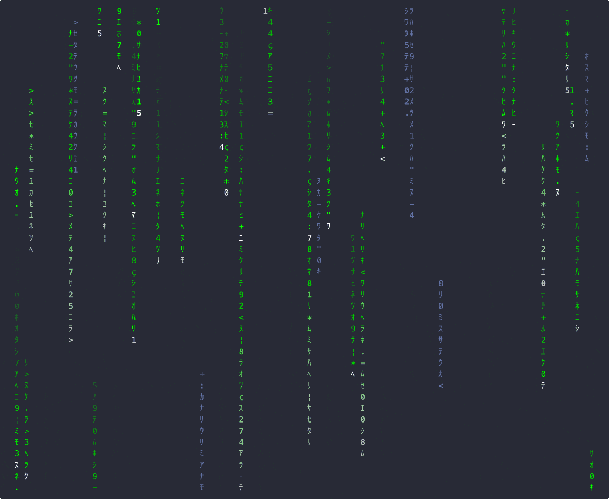

[](https://codecov.io/gh/oiwn/tarts)

# 🦀 TARTS: Terminal Arts 🎨

> **BLAZINGLY FAST** terminal screensavers written in Rust!

`tarts` (shortcut from **T**erminal **Arts**) is a collection of **MEMORY SAFE**
terminal-based screen savers that bring visual delight to your command line.
Built with **ZERO-COST ABSTRACTIONS**, these screen savers run efficiently while
providing stunning visual effects.



## ✨ Features

- 🌧️ **Matrix Rain**: Experience the famous "Matrix" digital rain effect right in your terminal
- 🧫 **Conway's Game of Life**: Watch the classic cellular automaton evolve before your eyes
- 🧩 **Maze Generation**: Get lost in procedurally generated mazes
- 🐦 **Boids**: Witness the emergent flocking behavior of these simulated birds
- 🧊 **3D Cube**: Renders a rotating 3D cube using terminal graphics with braille patterns for higher resolution
- 🦀 **Crab**: Animated crabs walking across your screen, interacting with each other and the environment
- 🍩 **Rotating Donut**: A mesmerizing rotating donut rendered in the terminal
- 🚰 **Pipes**: Watch pipes flow with a smooth animation
- 🔥 **Fire**: A cozy fireplace effect to warm up your terminal
- ⚡ **Plasma**: Electric plasma effect with vibrant colors and smooth animations
- 🎯 **Blank**: Simple blank screen with minimal resource usage

## 🚀 Installation

### Homebrew (macOS & Linux)
```bash
brew tap oiwn/tap && brew install tarts
```

### Cargo (Cross-platform)
```bash
cargo install tarts
```

### Nix

Direct from GitHub (always latest version):
```bash
nix run github:oiwn/tarts -- matrix
```

Or from the nixpkgs (may be older version):
```bash
nix-shell -p tarts --run "tarts matrix"
```

### Manual Download
Download the latest binary from [GitHub Releases](https://github.com/oiwn/tarts/releases)

## 🛠️ Usage

Run any effect by name:

```bash
tarts matrix   # The classic digital rain effect
tarts life     # Conway's Game of Life
tarts maze     # Watch a maze generate itself
tarts boids    # Bird-like flocking simulation
tarts cube     # 3D rotating cube using braille patterns
tarts crab     # Animated crabs with collisions
tarts donut    # Rotating donut
tarts pipes    # Pipes effect
tarts fire     # Fire effect
tarts plasma   # Electric plasma effect
tarts blank    # Simple blank screen
```

**Controls:** Press `q`, `Esc`, or `Ctrl+C` to exit

**Quick Test:** Try the most popular effect first!
```bash
tarts matrix
```

## 🎨 Effects Gallery

| Effect | Description | Perfect for |
|--------|-------------|-------------|
| **matrix** | Classic digital rain falling down your screen | Retro computing vibes |
| **life** | Conway's cellular automaton evolution | Watching patterns emerge |
| **maze** | Procedurally generated maze in real-time | Maze enthusiasts |
| **boids** | Flocking simulation with emergent behavior | Nature lovers |
| **cube** | 3D rotating cube with braille patterns | Geometry fans |
| **crab** | Animated crabs walking and interacting | Cute animations |
| **donut** | Mathematical 3D donut rotation | Math enthusiasts |
| **pipes** | Smooth flowing pipe animations | Mesmerizing effects |
| **fire** | Cozy fireplace simulation | Ambience and relaxation |
| **plasma** | Electric plasma with vibrant colors | Psychedelic effects |
| **blank** | Minimal blank screen | Resource conservation |

## 🧪 Development

This project uses standard Rust tooling:

```bash
# Build the project
cargo build --release

# Run tests
cargo test

# Benchmark performance
cargo bench
```

## 🤝 Contributing

Contributions are welcome! Please feel free to submit pull requests, report bugs, and suggest features.

## 📜 License

This project is licensed under the [MIT License](https://opensource.org/licenses/MIT).

---

<div align="center">
  <sub>Built with ❤️ and <strong>FEARLESS CONCURRENCY</strong></sub>
</div>
